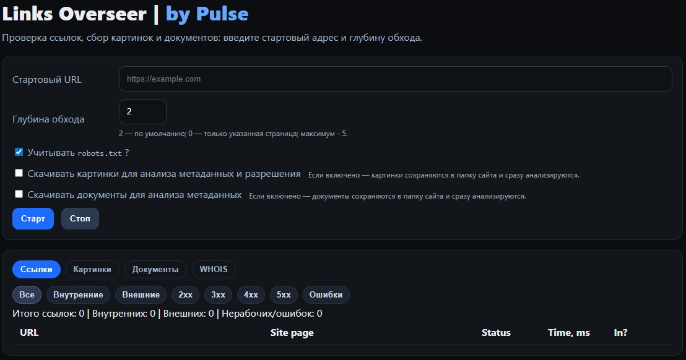
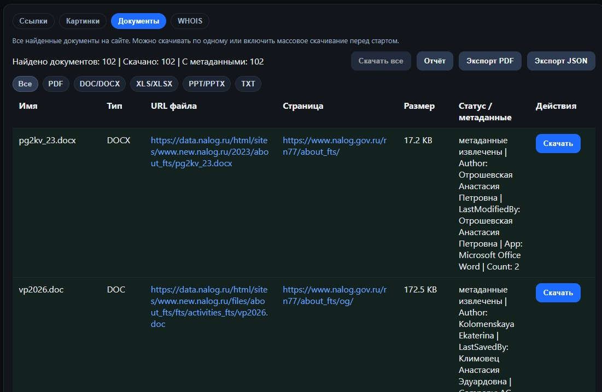
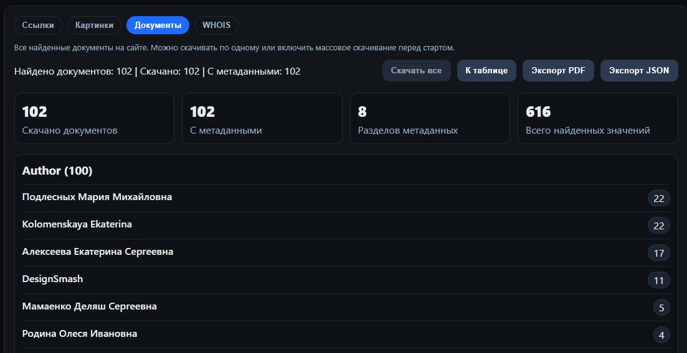

[English](README.en.md) | [Русский](README.md)

# Links Overseer

**Links Overseer** is a local OSINT tool for website analysis.   
It analyzes a given URL: crawls the site’s internal pages to the selected depth and shows all found links with their statuses and response times, while also collecting all images and documents from the site. Images are added to a gallery, and documents are added to a summary table.

---

## 🚀 Features

| 🔗 Links | 🖼️ Images | 📄 Documents |
|----------|-----------|-----------|
|Collects all links to the specified depth|Collects all image formats into a gallery|Collects all documents from the site|
|Checks the status of all links on the site|Image previews in the gallery|Extracts and analyzes document metadata|
|Displays response speed (in ms)|Collects the image URL and source page URL|Collects the document URL and source page URL|
|Determines whether a link is internal or external|Displays the image `alt` attribute|Report on extracted metadata|
|Filters and result summary|Bulk and individual downloading|Bulk and individual downloading|
|Supports crawling with or without respecting `robots.txt`|Metadata analysis and reverse image search|Report export to PDF/JSON|


---

## 💻 Interface

<p align="center">
  
</p>

### Main menu

| Element | Description |
|----------|-----------|
| **Start URL** | The page address where crawling begins |
| **Crawl depth** | The number of “steps” through internal links. <br> Value `0` checks links only on the entered page, `1` checks the start page + all links from it, `2` crawls 2 links deep, and so on. |
| **Respect robots.txt** | If enabled, the program does not enter sections disallowed in the `robots.txt` file |
| **Download images**| When enabled, the `data/<site>/` directory will be created. All found images will be saved there, and their metadata will be shown immediately in the results |
| **Download documents**| When enabled, the `data/<site>/documents` directory will be created. All found documents will be saved there, and their metadata will be shown immediately in the results |
| **“Start” button** | Starts the crawling process |
| **“Stop” button** | Interrupts the current check |
| **Progress bar** | Shows execution progress. Yellow while running, green when completed |


### ▪️ “Links” section

<p align="center">

</p>

| Element | Description |
|----------|-----------|
| **Filters** | Show only the required link categories in the report: all / internal / external / 2xx / 3xx / 4xx / 5xx / errors |
| **Results table** | Displays all found links in columns: URL, source (Site page), status, response time, type (internal/external). |


### ▪️ “Images” section

<p align="center">

</p>

| Element | Description |
|----------|-----------|
| **Gallery** | Results list: preview, image URL and the page where it was found, alt attribute, resolution |
| **Metadata** | To get metadata, you need to download the image or enable bulk downloading (the “Download images” checkbox) |
| **Actions** | Manual download and reverse search buttons for Google, Yandex, and Bing |

### ▪️ “Documents” section

<p align="center">

</p>

| Element | Description |
|----------|-----------|
| **Filters** | Show only selected document types in the report: PDF / DOC,DOCX / XLS,XLSX / PPT,PPTX / TXT |
| **Results table** | Results list: filename, type, file URL and the page where it was found, size, status |
| **Metadata** | To get metadata, you need to download the document manually or enable bulk downloading (the “Download documents” checkbox or the “Download all” button) |
| **Actions** | Manual download. As with bulk downloading, documents are placed in the `data/<site>/documents` folder |
| **Download all** | Bulk download of the documents listed in the results table |
| **Report** | General summary of found documents and metadata. Metadata is grouped by the number of detections. You can click each result and see the files where this record was found |
| **Export PDF** | Export found metadata to a PDF report |
| **Export JSON** | Export found metadata to a JSON report |

#### 💾 Downloading documents 

Two modes are available for documents:
- automatic bulk downloading via the checkbox before starting the analysis;
- manual downloading: one document at a time via the **“Download”** button, or all already found documents via the **“Download all”** button in the documents tab.

Bulk downloading via the **“Download all”** button works with documents already found in the current result and does not require re-running the site crawl. After downloading, the utility extracts and displays document metadata depending on the format. For legacy Microsoft Office formats (DOC, XLS, PPT), basic OLE/CFBF metadata parsing is implemented.

The utility also:
- decodes PDF metadata, including cases with complex internal encoding;
- correctly handles metadata from legacy Office documents;
- searches for contact fields and email addresses in metadata;
- shows found values in the general metadata column.

---

#### 📄 Report
<p align="center">

</p>

The **Report** is built only from already downloaded documents and shows:
- a general summary;
- all found metadata categories;
- values grouped by each category;
- the number of repetitions for each value;
- an expandable list showing which documents contain the value.

*If non-standard metadata keys are found, they are placed in a separate “Other” section.*

The report supports **export** in two formats:
- JSON — structured export of the summary report;
- PDF — PDF file generation.

The export includes only aggregated report data:
- metadata categories
- found values
- number of repetitions

To reduce document download failures, browser-like HTTP headers are used, the Referer of the page where the document link was found is passed, cookies are supported, and redirects are handled correctly. This helps download files from sites where a direct request without headers could result in errors such as 403 Forbidden.

### ▪️ “WHOIS” section

When you switch to the **“WHOIS”** tab, the tool retrieves the site’s data and displays it both in a table and in the original form. You do not need to remove `https://`, `www`, or the path after `/` from the “Start URL” field. It understands the input and takes only the part of the URL needed to retrieve the data.

---

## ⚙️ Running Links Overseer

### 1. Requirements

- **Go 1.25 or higher**
- Any OS: **Windows**, **macOS**, **Linux**  
  (everything works the same way, cross-platform)

Check your Go version:
```bash
go version
```

If Go is not installed, download it from [https://go.dev/dl/](https://go.dev/dl/).

---

### 2. Cloning the repository

```bash
git clone https://github.com/okpulse/links-overseer.git
cd links-overseer
```

---

### 3. Installing dependencies and running

```bash
go mod tidy
go run ./cmd/server
```

This will download all required packages. After launch, the browser will open. If it does not open, open it manually and go to:
```
http://localhost:8080/
```
- if a different port is used, it will be shown in the console at startup.

---

## 🔧 Building a binary (optional)

To build a ready-to-run executable file for the required system:

### Windows 


```bash
git clone https://github.com/okpulse/links-overseer.git
cd links-overseer
go mod tidy
cd cmd/server
go build -o links-overseer.exe

```

### macOS / Linux
  

```bash
git clone https://github.com/okpulse/links-overseer.git
cd links-overseer
go mod tidy
cd cmd/server
go build -o links-overseer
```

After building, the file can be run directly without Go:
```bash
./links-overseer
```

---

## 🔒 Security and privacy

Links Overseer works entirely locally. The application does not send or receive any data from the internet except for the URLs you specify for checking.

**What you should know:**
- On startup, the program launches a web interface at `http://localhost:8080`  
  It is available only to you and is not visible on the network.
- All checks are performed locally; data is not saved or sent anywhere externally
- links behind CloudFlare may sometimes appear as not working

💡 On first launch, your antivirus may warn you about an “unknown file”.  
*This is a normal reaction to new executable files without a digital signature. Just let the antivirus scan the file, and it will mark it as safe.*

---

## 🗃️ Version history:
- `v0.1` - collects links from a site and checks whether they work;
- `v0.2` - collects images and displays them in a gallery, with bulk or manual download support. Can search for metadata; reverse image search buttons for search engines have been added;
- `v0.3` - WHOIS data retrieval;
- `v1.0` - finds documents on a site, downloads them, and extracts metadata.
- `v1.1`(*current*) - English localization added.

---

## 💼 About the author
If you are interested in OSINT, I recommend visiting my resources:

[](https://hacker-basement.com/) [](https://www.youtube.com/@pulse_os) [](https://t.me/Pulsechanel)


---

## ❤️ Support the project

If the project has been useful and you would like it to continue developing, you can support development financially:

- [💎 Patreon](https://www.patreon.com/pulsepagemy)
- [⭐ Become a sponsor on YouTube](https://www.youtube.com/channel/UCojEUrPvEvkUXEU3QWwhCwg/join)
- [💰 Monobank Jar](https://send.monobank.ua/jar/U32Yc8ML3) 
- 💲 **USDT (TRC20):** `TJ8pim1cBjGnypABnn27iq3FY9EVo16D7k`  
