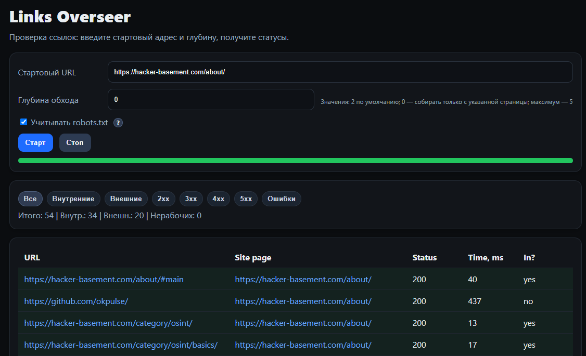

# Links Overseer

**Links Overseer** — это локальный инструмент для проверки ссылок на сайте.  
Он анализирует заданный URL, проходит по внутренним страницам сайта на нужную глубину и показывает все найденные ссылки с их статусами и временем отклика.

---

## 🚀 Возможности

- Проверка статусов всех ссылок на сайте (2xx, 3xx, 4xx, 5xx, ошибки).
- Отображение скорости отклика (в мс).
- Определение, является ли ссылка внутренней или внешней.
- Показывает прогресс выполнения (progress bar).
- Фильтры и сводка по результатам.
- Поддержка обхода с учётом или без учёта `robots.txt`.

**Инструмент помогает:**
- находить битые ссылки;
- проверять редиректы и SEO-настройки;
- делать аудит сайта после обновления или переноса;
- выявлять медленные страницы.

---

## 💻 Интерфейс



### Основные элементы:

| Элемент | Описание |
|----------|-----------|
| **Стартовый URL** | Адрес страницы, с которой начинается обход |
| **Глубина обхода** | Количество "шагов" по внутренним ссылкам. Значение `0` — проверяются ссылки только на введённой странице, `1` — стартовая + все ссылки с неё, `2` — глубже и т.д. |
| **Учитывать robots.txt** | Если включено — программа не заходит в разделы, запрещённые в файле `robots.txt` |
| **Кнопка "Старт"** | Запускает процесс обхода |
| **Кнопка "Стоп"** | Прерывает текущую проверку |
| **Прогресс-бар** | Показывает ход выполнения. Во время работы — жёлтый, по завершении — зелёный |
| **Фильтры** | В отчёте показывать только нужные категории ссылок: внутренние / внешние / 2xx / 3xx / 4xx / 5xx / ошибки |
| **Таблица результатов** | Отображает все найденные ссылки с колонками: URL, источник (Site page), статус, время отклика, тип (внутренняя/внешняя). |

---

## ⚙️ Запуск Links Overseer

### 1. Требования

- **Go 1.25 или выше**
- Любая ОС: **Windows**, **macOS**, **Linux**  
  (всё работает одинаково, мультиплатформенно)

Проверить версию Go:
```bash
go version
```

Если Go не установлен — загрузите его с [https://go.dev/dl/](https://go.dev/dl/).

---

### 2. Клонирование репозитория

```bash
git clone https://github.com/okpulse/links-overseer.git
cd links-overseer
```

---

### 3. Установка зависимостей

```bash
go mod tidy
```

Команда автоматически скачает все нужные пакеты.

---

### 4. Запуск приложения

```bash
go run ./cmd/server
```

После запуска откроется браузер, если не открылся - откройте и перейдите по адресу:
```
http://localhost:8080/
```
(если порт другой — он указывается в консоли при старте).

Интерфейс полностью локальный.

---

## 🔧 Сборка бинарника (по желанию)

Чтобы собрать готовый исполняемый файл под нужную систему:

### Windows
```bash
git clone https://github.com/okpulse/links-overseer.git
cd links-overseer
go mod tidy
cd cmd/server
go build -o links-overseer.exe

```

### macOS / Linux
```bash
git clone https://github.com/okpulse/links-overseer.git
cd links-overseer
go mod tidy
cd cmd/server
go build -o links-overseer
```

После сборки, файл можно запускать напрямую без Go:
```bash
./links-overseer
```

---

## 🧩 Как работает обход

- Программа получает стартовый URL.
- Ищет все ссылки (`<a href="...">`).
- Проверяет их статус кодом HTTP.
- Если глубина обхода > 0 — переходит по внутренним ссылкам и повторяет процесс.
- *ссылки за CloudFlare иногда могут показываться как не работающие*
- Все результаты выводятся в таблицу с цветовой подсветкой по типу ответа.

---

## 🔒 Безопасность и приватность

Links Overseer работает полностью локально. Приложение не передаёт и не получает никаких данных из интернета, кроме тех URL, которые вы сами указали для проверки.

**Что важно знать:**
- При запуске программа поднимает веб-интерфейс на `http://localhost:8080` (или другой порт).  
  Он доступен только вам и не виден в сети.
- Все проверки выполняются локально, данные не сохраняются и не отправляются наружу.

💡 *При первом запуске антивирус может предупредить о "неизвестном файле".*  
Это нормальная реакция на новые исполняемые файлы без цифровой подписи.  
После проверки антивирус обычно помечает файл как безопасный.

---

## 🌐 Про автора
Если интересуетесь темой OSINT, рекомендую посетить мои ресурсы:

[](https://hacker-basement.com/) [](https://www.youtube.com/@pulse_os) [](https://t.me/Pulsechanel)

---

## ❤️ Поддержать проект

Если проект оказался полезен и хочется что бы он развивался, можно поддержать разработку финансово:

- [💎 Patreon](https://www.patreon.com/pulsepagemy)
- [⭐ Стать спонсором на YouTube](https://www.youtube.com/channel/UCojEUrPvEvkUXEU3QWwhCwg/join)
- [💰 Банка Monobank](https://send.monobank.ua/jar/U32Yc8ML3) 
- 💲 **USDT (TRC20):** `TMDLY3qRZN81b5xn9Z9Wg2y3Y6aeBpV5Z6`  