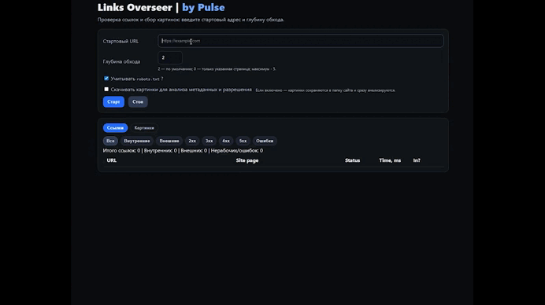
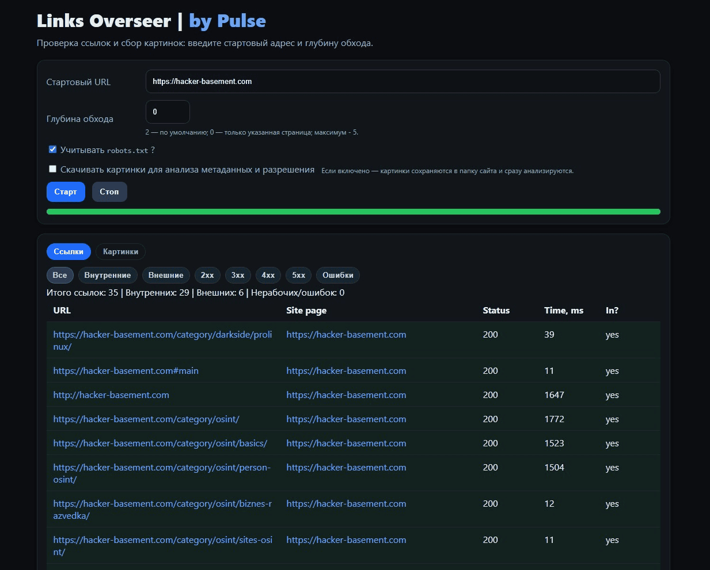
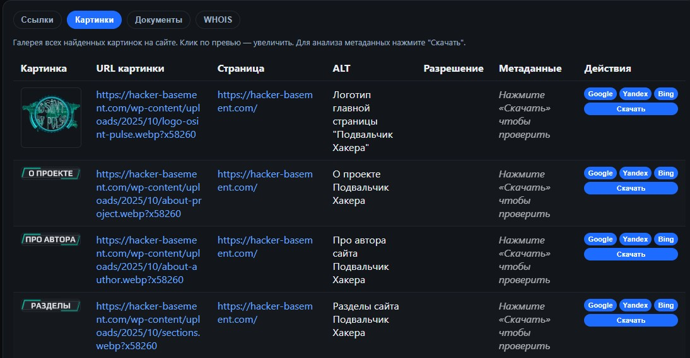

# Links Overseer

**Links Overseer** — это локальный OSINT-инструмент для анализа сайтов.   
Анализирует заданный URL: проходит по внутренним страницам сайта на выбранную глубину и показывает все найденные ссылки с их статусами и временем отклика, а также собирает все картинки с сайта, показывая их в галерее. Изображения можно скачивать и получать их метаданные, а также выполнять обратный поиск через Google, Yandex, Bing. 


---

## 🚀 Возможности

| 🔗Ссылки | 🖼️Картинки |
|----------|-----------|
|Сбор всех ссылок на заданую глубину|Сбор всех картинок всех форматов в галерею|
|Проверка статусов всех ссылок на сайте (2xx, 3xx, 4xx, 5xx, ошибки)|Предпросмотр картинок в галерее|
|Отображение скорости отклика (в мс)|Сбор URL: картинки и страницы |
|Определение, является ли ссылка внутренней или внешней|Просмотр `alt` атрибута картинки|
|Фильтры и сводка по результатам|Скачивание: массовое и по отдельности|
|Поддержка обхода с учётом или без учёта `robots.txt`|Анализ метаданных и обратный поиск по изображению |


---

## 💻 Интерфейс

<p align="center">
  
</p>

### Главное меню

| Элемент | Описание |
|----------|-----------|
| **Стартовый URL** | Адрес страницы, с которой начинается обход |
| **Глубина обхода** | Количество "шагов" по внутренним ссылкам. <br> Значение `0` — проверяются ссылки только на введённой странице, `1` — стартовая + все ссылки с неё, `2` — на 2 ссылки в глубь и т.д. |
| **Учитывать robots.txt** | Если включено — программа не заходит в разделы, запрещённые в файле `robots.txt` |
| **Скачивать картинки**| При включении будет создан каталог `data/<сайт>/`. Все найденные картинки будут сохранены туда, а в результатах сразу показаны метаданные|
| **Кнопка "Старт"** | Запускает процесс обхода |
| **Кнопка "Стоп"** | Прерывает текущую проверку |
| **Прогресс-бар** | Показывает ход выполнения. Во время работы — жёлтый, по завершении — зелёный |


### Раздел "Ссылки"

<p align="center">

</p>

| Элемент | Описание |
|----------|-----------|
| **Фильтры** | В отчёте показывать только нужные категории ссылок: все / внутренние / внешние / 2xx / 3xx / 4xx / 5xx / ошибки |
| **Таблица результатов** | Отображает все найденные ссылки по колонкам: URL, источник (Site page), статус, время отклика, тип (внутренняя/внешняя). |


### Раздел "Картинки"

<p align="center">

</p>

| Элемент | Описание |
|----------|-----------|
| **Галерея** | Список результатов: превью, URL картинки и страницы где она найдена, атрибут alt, разрешение |
| **Метаданные** | Чтобы получить метаданные нужно скачать картинку или включить массовое скачивание (чек-бокс "Скачивать картинки")|
| **Действия** | Ручное скачивание (будет создан каталог `data/<сайт>/`) и кнопки обратного поиска в Google, Yandex, Bing |

---

## ⚙️ Запуск Links Overseer

### 1. Требования

- **Go 1.25 или выше**
- Любая ОС: **Windows**, **macOS**, **Linux**  
  (всё работает одинаково, мультиплатформенно)

Проверить версию Go:
```bash
go version
```

Если Go не установлен — загрузите его с [https://go.dev/dl/](https://go.dev/dl/).

---

### 2. Клонирование репозитория

```bash
git clone https://github.com/okpulse/links-overseer.git
cd links-overseer
```

---

### 3. Установка зависимостей и запуск

```bash
go mod tidy
go run ./cmd/server
```

Скачает все нужные пакеты. После запуска откроется браузер. Если не открылся - откройте и перейдите по адресу:
```
http://localhost:8080/
```
- если порт другой — он указывается в консоли при старте.


---

## 🔧 Сборка бинарника (по желанию)

Чтобы собрать готовый исполняемый файл под нужную систему:

### Windows 


```bash
git clone https://github.com/okpulse/links-overseer.git
cd links-overseer
go mod tidy
cd cmd/server
go build -o links-overseer.exe

```

### macOS / Linux
  

```bash
git clone https://github.com/okpulse/links-overseer.git
cd links-overseer
go mod tidy
cd cmd/server
go build -o links-overseer
```

После сборки, файл можно запускать напрямую без Go:
```bash
./links-overseer
```

---

## 🔒 Безопасность и приватность

Links Overseer работает полностью локально. Приложение не передаёт и не получает никаких данных из интернета, кроме тех URL, которые вы сами указали для проверки.

**Что важно знать:**
- При запуске программа запускает веб-интерфейс на `http://localhost:8080`  
  Он доступен только вам и не виден в сети.
- Все проверки выполняются локально, данные не сохраняются и не отправляются наружу
- ссылки за CloudFlare иногда могут показываться как не работающие

💡 При первом запуске антивирус может предупредить о "неизвестном файле".  
*Это нормальная реакция на новые исполняемые файлы без цифровой подписи. Просто дайте антивирусу проверить файл и он пометит его как безопасный.*

---

## 🗃️ История версий:
- `v0.1` - собирает ссылки с сайта, проверяет их работоспособность;
- `v0.2` (*текущая*) - собирает картинки, показывая их в галерее, с возможностью массового или ручного скачивания. Может искать метаданные, добавлены кнопки обратного поиска по картинкам в поисковиках.

---

## 💼 Про автора
Если интересуетесь темой OSINT, рекомендую посетить мои ресурсы:

[](https://hacker-basement.com/) [](https://www.youtube.com/@pulse_os) [](https://t.me/Pulsechanel)


---

## ❤️ Поддержать проект

Если проект оказался полезен и хочется что бы он развивался, можно поддержать разработку финансово:

- [💎 Patreon](https://www.patreon.com/pulsepagemy)
- [⭐ Стать спонсором на YouTube](https://www.youtube.com/channel/UCojEUrPvEvkUXEU3QWwhCwg/join)
- [💰 Банка Monobank](https://send.monobank.ua/jar/U32Yc8ML3) 
- 💲 **USDT (TRC20):** `TMDLY3qRZN81b5xn9Z9Wg2y3Y6aeBpV5Z6`  